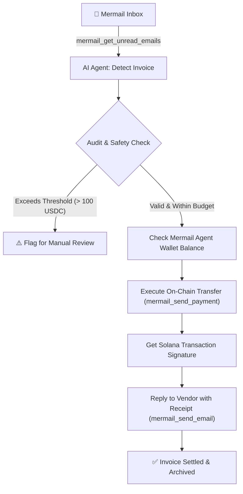

# 🤖 Auto-Invoice Paymaster (Autonomous Accounts Payable Agent)

## Overview
**Auto-Invoice Paymaster** is a production-ready Mermail Agent Skill that transforms an AI agent into an autonomous **Accounts Payable (AP) and Financial Settlement Officer**.

Traditional billing workflows require manual human intervention: reading incoming emails, checking invoice line items against budgets, copying cryptocurrency wallet addresses, and executing payments. This skill delegates this entire lifecycle to an AI agent leveraging **Mermail's dual MCP superpowers**:
1. **Mermail Inbox:** To asynchronously monitor, receive, and parse incoming billing requests, vendor invoices, and freelancer payment claims.
2. **Mermail Agent Wallet:** To verify liquidity, enforce user-defined spending safety guardrails, execute on-chain Solana/USDC micro-settlements, and dispatch cryptographically verifiable payment receipts.

---

## ⚡ What This Skill Enables
- **Automated Invoice Intake:** Continuously checks the agent's dedicated Mermail inbox for messages tagged with `#invoice`, `Payment Request`, or attached structured billing data.
- **AI Audit & Budget Enforcement:** Uses reasoning to audit line items, check whether the invoice exceeds the maximum autonomous spending limit (e.g. max 50 USDC without human escalation), and verify recipient addresses.
- **Autonomous On-Chain Settlement:** Directly executes payments from the Mermail Agent Wallet via MCP tools.
- **Proof-of-Payment Receipts:** Automatically generates an on-chain transaction receipt and replies to the vendor's email thread confirming fulfillment.
- **Audit Logging:** Emits structured JSON audit trails for bookkeeping and tax compliance.

---

## 🔌 Mermail MCP Tool Interactions

This skill interacts directly with the Mermail Model Context Protocol (MCP) server endpoints:

| Action | Mermail MCP Tool | Purpose |
| :--- | :--- | :--- |
| **Check Messages** | `mermail_get_unread_emails` | Scans the agent's inbox for incoming payment requests and invoices. |
| **Read Invoice Details** | `mermail_read_email` | Extracts email body, vendor details, due amount, currency, and recipient address. |
| **Check Liquidity** | `mermail_get_wallet_balance` | Queries the Agent Wallet balance to ensure sufficient funds before executing. |
| **Execute Transfer** | `mermail_send_payment` | Dispatches the agreed USDC/SOL payment directly to the vendor's address. |
| **Send Confirmation** | `mermail_send_email` | Replies to the vendor thread with the transaction hash and payment confirmation. |

---

## 🔄 End-to-End Workflow



### Detailed Execution Steps:
1. **Trigger:** The agent receives a command or runs on a scheduled heartbeat to inspect the Mermail inbox.
2. **Parsing:** The LLM parses the invoice content (Vendor name, invoice number, description of deliverables, amount in USDC, and destination Solana public key).
3. **Safety Guardrail Check:**
   - Verify that the destination address is a valid base58 Solana address.
   - Verify that `amount <= max_autonomous_threshold` (e.g. 50 USDC).
4. **Wallet Check:** The agent invokes `mermail_get_wallet_balance`. If balance is sufficient, proceeds to settlement.
5. **Execution:** The agent calls `mermail_send_payment(to=recipient, amount=amount, token="USDC")`.
6. **Confirmation:** The agent calls `mermail_send_email` to the vendor's sender address with subject `PAID: Invoice [Number] - Receipt [TxHash]`.

---

## 💬 Example Prompts & Expected Results

### Prompt 1: Regular Scheduled Sweep
```text
User: "Agent, inspect your Mermail inbox, process any pending contractor invoices within our 50 USDC budget limit, and settle them."
```

#### Expected Agent Response & Tool Calls:
```text
1. [Tool Call] mermail_get_unread_emails()
   -> Found 1 email from "alex.designer@solmail.org" | Subject: "Invoice #1042 - UI Icons Design (35 USDC)"

2. [Reasoning] 
   - Vendor: Alex Designer
   - Amount: 35 USDC (Under our 50 USDC autonomous limit)
   - Destination: 7xKXtg2CW87d97TXJSDpbD5jBkheTqA83TZRuJosgAsU
   - Status: APPROVED FOR PAYMENT.

3. [Tool Call] mermail_get_wallet_balance()
   -> Balance: 120.50 USDC, 0.45 SOL.

4. [Tool Call] mermail_send_payment(
     recipient="7xKXtg2CW87d97TXJSDpbD5jBkheTqA83TZRuJosgAsU",
     amount=35,
     currency="USDC"
   )
   -> Result: Success! TxSignature: 5hN7W3...8xQp

5. [Tool Call] mermail_send_email(
     to="alex.designer@solmail.org",
     subject="RE: Invoice #1042 - Payment Confirmed",
     body="Hello Alex, your invoice #1042 for 35 USDC has been audited and paid automatically by our Mermail Agent. Transaction Signature: https://solscan.io/tx/5hN7W3...8xQp. Thank you!"
   )

Agent: "All done! Successfully audited and settled Invoice #1042 for 35 USDC to Alex Designer. Confirmation email sent with on-chain proof."
```

### Prompt 2: High-Value Threshold Guardrail
```text
User: "Check inbox and pay all invoices."
Agent: "Found invoice from 'acme.hosting@corp.com' for 450 USDC. This exceeds your autonomous limit of 50 USDC. Flagged as PENDING_HUMAN_APPROVAL. No funds were spent."
```

---

## 🛡️ Security & Safety Safeguards
- **Strict Spending Cap:** Never auto-executes single transactions exceeding configured user limits.
- **Recipient Address Sanity Check:** Validates Solana address encoding before calling MCP payment tools.
- **Anti-Duplication:** Keeps track of processed `invoice_id` strings to prevent double-spending the same invoice.

---

## 🚀 Reusability for Builders
Any developer with an MCP-enabled client (Cursor, Claude Desktop, Antigravity, or custom LangChain/Autogen agents) can plug in this skill by simply installing the Mermail MCP server and referencing this `SKILL.md`.
