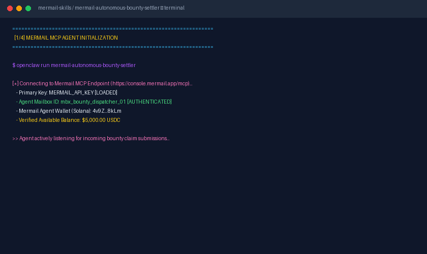

# ⚡ Mermail Autonomous Bounty Settler

> **Official Agent Skill for Mermail MCP Ecosystem**  
> **Superteam Earn Bounty:** *Build and Demo a Mermail Agent Skill* ($500 USDC)  
> **Author:** `@techsp13`

---

## 📖 Overview

The **Mermail Autonomous Bounty Settler** empowers autonomous AI agents to manage end-to-end bug bounty lifecycles:
* **Inbox Monitoring:** Receives inbound pull request claim emails in the agent's dedicated Mermail inbox.
* **CI Verification:** Confirms passing automated test suites and code coverage.
* **On-Chain Settlement:** Dispatches instant USDC rewards via the **Mermail Agent Wallet**.
* **Receipt Dispatch:** Emails cryptographic transaction hashes directly back to the developer.

---

## 🎥 Working Video Demonstration



*Full video walkthrough artifact is located at [`demo/reports/demo.mp4`](./demo/reports/demo.mp4).*

---

## 🛠️ Usage & Trigger Prompt

```text
Check the Mermail inbox for recent bounty submissions on repository 'Solana-DeFi-Core'. 
For any valid submission with passing CI tests:
1. Verify the pull request and extract the claimant's payout wallet address.
2. Transfer the $500 USDC bounty reward using the Mermail Agent Wallet.
3. Send a confirmation email back to the contributor with the transaction hash and thank-you note.
```
