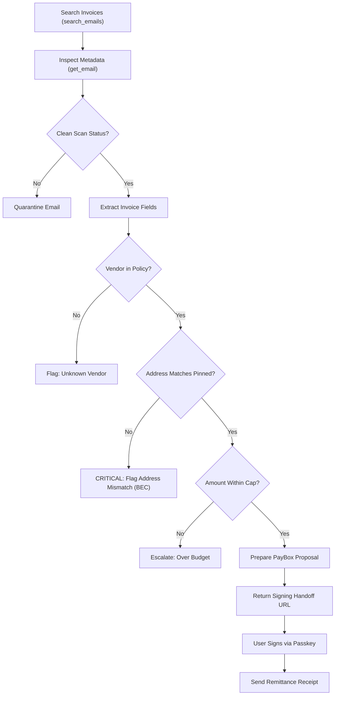

# Workflows Reference: Mermail Invoice Clerk

Detailed operational workflows for accounts payable processing.

## 1. Daily Ingestion & Triage Workflow



## 2. Ingestion & Field Normalization

The agent parses invoice data into a canonical structure:
```json
{
  "vendor_id": "datadog-inc",
  "vendor_name": "Datadog, Inc.",
  "sender_email": "billing@datadoghq.com",
  "invoice_number": "INV-DD-2026-9041",
  "issue_date": "2026-09-15",
  "due_date": "2026-10-15",
  "total_amount": 320.00,
  "currency": "USDC",
  "payment_rail": "evm",
  "remittance_address": "0x534c561765c92c813587b140685744f475a894a7"
}
```

## 3. Fraud Detection Cases

### Case A: BEC / Payment Detail Tampering
- An email arrives from an authorized vendor domain, but the invoice specifies a new wallet or IBAN address.
- Action: The agent refuses to propose or execute a transfer. The thread is labeled `Audit/AddressMismatch`, and an alert is drafted for the human finance administrator.

### Case B: Urgent Phishing / Deadline Pressure
- Invoices emphasizing extreme urgency ("PAY WITHIN 1 HOUR OR SERVICES WILL BE CUT") often indicate phishing.
- Action: The agent maintains normal verification pacing and strictly requires the same cryptographic address pinning check.

## 4. PayBox Execution Sequence

1. Call `get_paybox_connection` -> verify `status: "ACTIVE"`.
2. Call `paybox_get_portfolio` -> confirm balance >= invoice amount.
3. Present detailed preview to user in chat:
   - Vendor Name
   - Invoice Reference
   - Amount and Asset
   - Pinned Recipient Address
   - Policy Status
4. User responds with confirmation -> Call `paybox_request_transfer`:
   ```json
   {
     "to_address": "0x534c561765c92c813587b140685744f475a894a7",
     "amount": "320.00",
     "token": "USDC",
     "chain": "base",
     "memo": "Payment for INV-DD-2026-9041"
   }
   ```
5. Extract `signing_handoff.console_url` and deliver to user.
6. Await human signature confirmation.

## 5. Post-Settlement Remittance

Once signature confirms via `paybox_get_request` with `status: "success"`:
1. Call `reply_to_email` or `send_email` to notify vendor billing:
   - "Thank you. Payment for invoice #INV-DD-2026-9041 (320.00 USDC) has been completed via PayBox. Transaction reference: [TX_HASH]."
2. Tag thread as `Audit/Paid` via `create_custom_label` or `move_email`.
