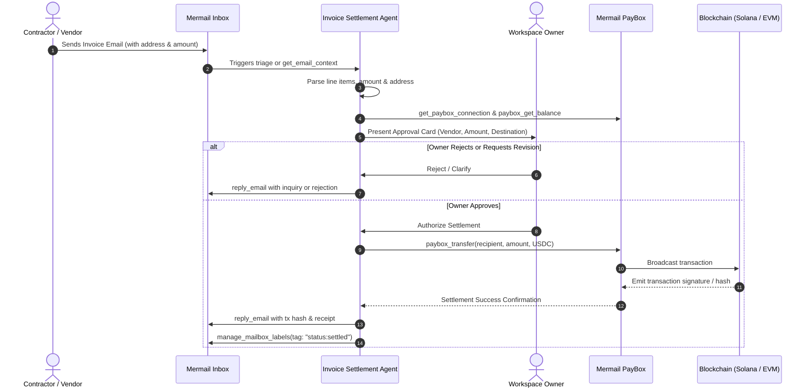

# Mermail Invoice Settlement Agent — Workflows Reference

## Detailed Execution Steps

### 1. Ingestion & Validation
1. Extract currency. Only `USDC`, `USDT`, and major stablecoins supported by PayBox are valid for automated settlement. Fiat invoices require explicit conversion quote.
2. Verify address checksum:
   - Solana: 32–44 base58 characters.
   - EVM: 42-character hex with valid checksum (`0x...`).

### 2. Idempotency Check
1. Query workspace invoice ledger for `invoice_id`.
2. If `invoice_id` has already been recorded as `settled`, halt immediately and alert the user with duplicate detection warning.

### 3. Settlement Execution
1. Verify PayBox connection status is `ACTIVE`.
2. Construct transfer payload with exact principal amount.
3. Upon receiving transaction hash, construct the block explorer URL (`solscan.io` or `basescan.org`).
