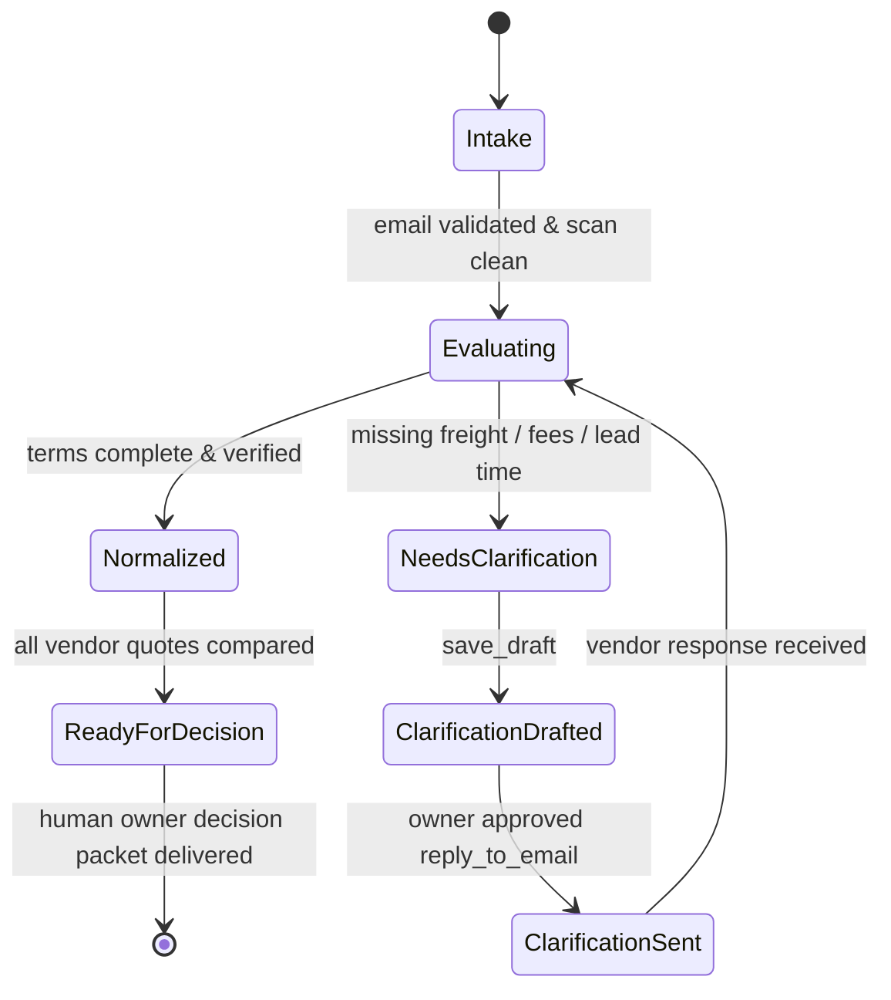

# RFQ Quotation Lifecycle

The quotation evaluation lifecycle enforces deterministic state transitions from initial supplier email intake to owner procurement decision.

## State Definitions

| State | Invariants & Requirements | Allowed Tool Actions |
| :--- | :--- | :--- |
| `Intake` | Inbound email located via RFQ reference or vendor domain. Scan status must be `clean`. | `list_mailboxes`, `search_emails`, `get_email` |
| `Evaluating` | Text parsed within 10,000 char budget. Extracts: items, unit price, MOQ, lead time, currency, payment terms. | `get_email_context`, `download_attachment` |
| `NeedsClarification` | Missing or ambiguous commercial terms flagged (freight, sales tax, Incoterms, warranty, delivery address). | None (state transition) |
| `ClarificationDrafted` | Professional clarification drafted in vendor thread without auto-sending. | `save_draft` |
| `ClarificationSent` | Draft reviewed and explicitly authorized by owner with verified recipient and content. | `reply_to_email` |
| `Normalized` | Complete commercial terms validated without missing fields. | None (analytical normalization) |
| `ReadyForDecision` | Structured comparison table prepared for human buyer evaluation. | None (owner report presentation) |

## State Boundary Invariants

1. **Missing Fee Non-Zero Invariant**: If freight, taxes, customs, or handling are not explicitly quoted by a vendor, the agent MUST NOT assume zero or invent an estimate. The quote must transition to `NeedsClarification` or be marked as `UNSPECIFIED / EXCLUDED`.
2. **Draft Delivery Invariant**: A draft created during `ClarificationDrafted` NEVER authorizes automatic transmission. The system must remain paused until human confirmation.
3. **No Financial Commitment Invariant**: The skill terminates at `ReadyForDecision`. Awarding contracts, issuing Purchase Orders, signing agreements, or transferring funds is strictly outside agent authority.
