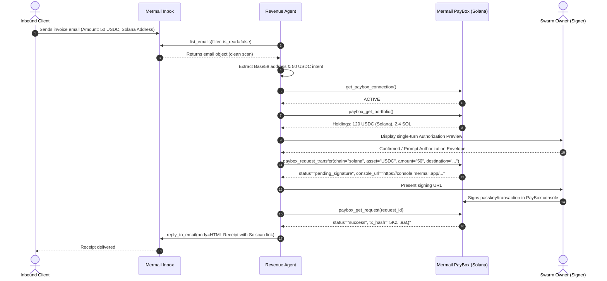
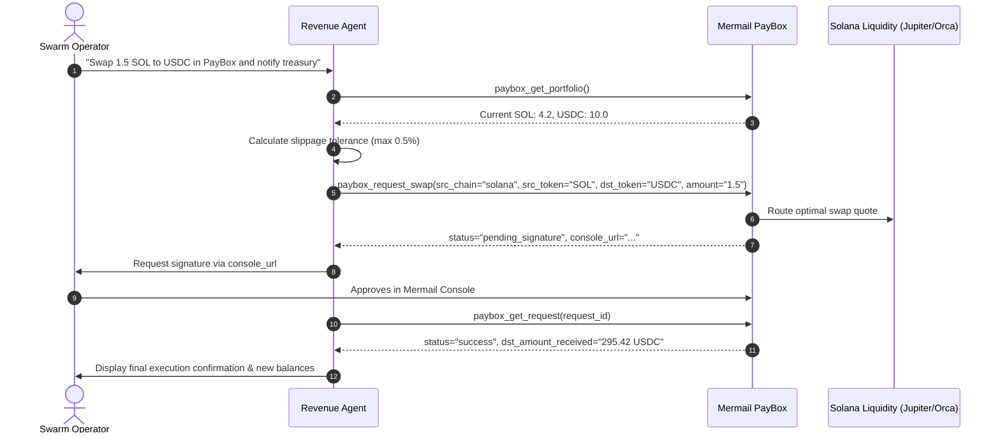
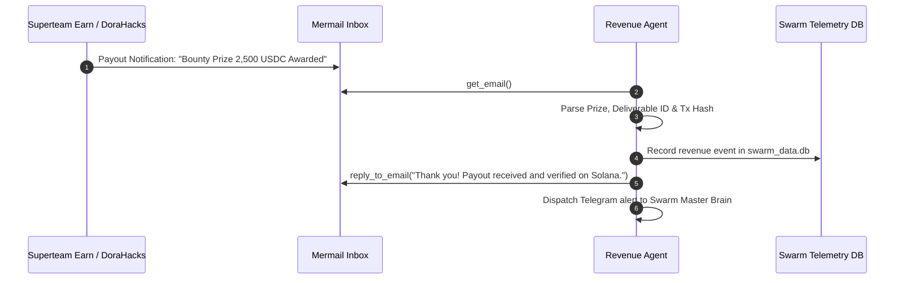

# Mermail Solana Revenue Agent Workflows

Detailed step-by-step execution workflows for inbound invoice triage, Solana token swaps, and cryptographic receipt generation.

---

## Workflow 1: Inbound Solana Invoice Processing & Settlement

### Execution Steps
1. **Fetch & Sanitize:** Call `list_emails(limit=10, is_read=false)` and select target message. Validate `scan_status == "clean"`.
2. **Entity Extraction:** Parse the requested payment currency, destination Solana wallet address, and line-item details.
3. **Connection Check:** Probe `get_paybox_connection`. If unlinked, generate connection deep link and pause.
4. **Portfolio Read:** Call `paybox_get_portfolio`. Verify sufficient `USDC` balance ($\ge 50$) and `SOL` for rent exemption.
5. **Execution:** Dispatch `paybox_request_transfer`.
6. **Reconciliation:** Poll `paybox_get_request(request_id)` once until terminal state `success`.
7. **Receipt Delivery:** Dispatch formatted HTML email with itemized table and Solscan link (`https://solscan.io/tx/{tx_hash}`).

---

## Workflow 2: Automated Solana DEX Swap & Liquidity Rebalancing

### Execution Steps
1. **Validate Swap Limits:** Confirm `amount` does not exceed user's authorized threshold.
2. **Quote & Submit:** Invoke `paybox_request_swap(credential_id, src_chain="solana", src_token="SOL", dst_token="USDC", amount="1.5")`.
3. **Capture Signature:** Direct user to single `signing_handoff.console_url`.
4. **Verify Settlement:** Reconcile via `paybox_get_request`.
5. **Report:** Output structured Markdown summary of traded pair, effective execution price, and updated portfolio.

---

## Workflow 3: Superteam / DoraHacks Bounty Payout Triage & Accounting

